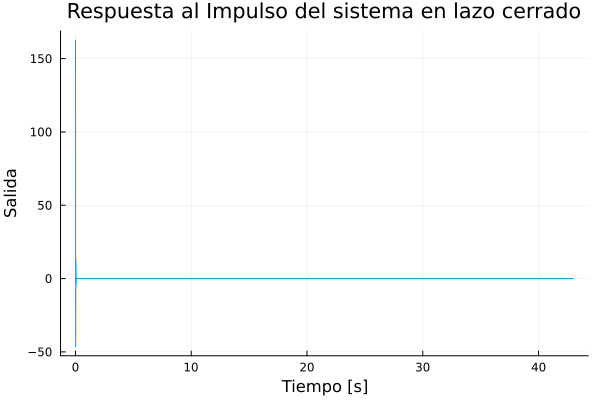
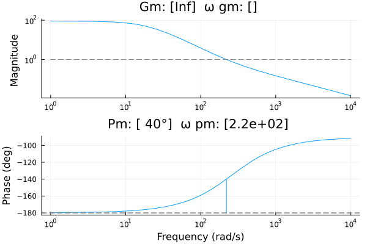
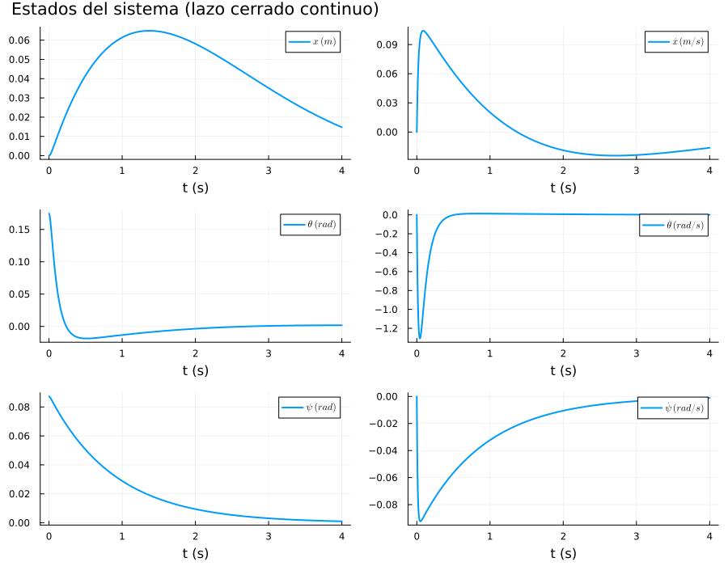

# Control de un Robot de Balance (MicroROS Self-Balancing Robot Car)

El presente repositorio consta de la documentación para el proyecto de la asignatura de Control, el cual consistió en diseñar dos controladores —un LQR y un PID— para un robot de balance tipo *MicroROS Self-Balancing Robot Car*. A continuación se presenta la explicación de los controladores implementados.

## PID

### Matrices del Sistema (Continuo)

**Estado:** `x = [posición, vel. lineal, ángulo, vel. angular, ángulo giro, vel. giro]`

```julia
Q_aux = J_centroide * M + (J_centroide + M*L^2) * (2*m + 2*inercia/r^2)

A_23 = -(M^2 * L^2 * g) / Q_aux
A_43 =  M * L * g * (M + 2*m + 2*inercia/r^2) / Q_aux

B_21 = (J_centroide + M*L^2 + M*L*r) / (Q_aux * r)
B_22 = B_21

B_41 = -(M*L/r + M + 2*m + 2*inercia/r^2) / Q_aux
B_42 = B_41

B_61 =  1 / (r * (m*d + inercia*d/r^2 + 2*J_Y_delta/d))
B_62 = -B_61

# ============================================================
# 3. MATRICES DEL SISTEMA (CONTINUO) Y DISCRETIZACIÓN
#    Estado: x = [posición, vel. lineal, ángulo, vel. angular,
#                 ángulo giro, vel. giro]
# ============================================================

A = [0  1    0    0  0  0;
     0  0  A_23   0  0  0;
     0  0    0    1  0  0;
     0  0  A_43   0  0  0;
     0  0    0    0  0  1;
     0  0    0    0  0  0]

B = (inercia/r) .* [0     0   ;
                    B_21  B_22;
                    0     0   ;
                    B_41  B_42;
                    0     0   ;
                    B_61  B_62]
```

A partir de este modelo se diseñaron tres controladores: dos PD (uno para la posición y otro para el ángulo de giro) y un PI para la velocidad angular.

### PD (Posición)

Dado que en este caso no se buscaba controlar el ángulo de giro, el sistema se redujo a 4 variables de estado, combinando ambas señales de control en una sola entrada:

```julia
Ai = A[1:4, 1:4]
Bi = B[1:4,1] + B[1:4,2]
Ci = [0.0  0.0  1.0  0.0]
Di = [0.0]
```

La función de transferencia en el dominio del tiempo continuo resultante es:

$$G(s) = \frac{-2.8026801158626995}{1.0s^2 - 410.9716109240051}$$

Al tratarse de un sistema naturalmente inestable —comportamiento esperable dado que el modelo se asemeja al de un péndulo invertido—, sus polos se ubican a ambos lados del eje imaginario:

```
Polos de G: [-20.27243475569733, 20.272434755697333]
```

Para el diseño del controlador se empleó el método de *Loop Shaping*, implementado en Julia. Se fijaron los siguientes parámetros de diseño:

```julia
ωgc = 220     # Frecuencia de cruce de ganancia [rad/s]
ϕm  = 40.0    # Margen de fase deseado [°]
```

Los valores de ganancia obtenidos fueron:

```julia
Kp = -13341.291913464405
Kd = -50.88487783643825
```

Las ganancias resultan negativas debido a que la planta misma tiene ganancia negativa; este signo es necesario para preservar la realimentación negativa del lazo.

Con estas ganancias, la función de transferencia del controlador (`Kp + Kd*s`) es:

```
      -50.88487783643825s - 13341.291913464405
      -------------------------------------------
                        1.0
```

Con el controlador definido, se construyó la función de transferencia de lazo cerrado:

```
Lazo cerrado: TransferFunction{Continuous, ControlSystemsBase.SisoRational{Float64}}

     142.61403531028807s + 37391.37356578652
-------------------------------------------------
     1.0s^2 + 142.61403531028807s + 36980.401954862515
```

<p align="center">
  
  
</p>

### PD (Ángulo de Giro)

Se realizó un proceso muy similar al caso anterior; sin embargo, en esta ocasión no se llevó a cabo la reducción del sistema, sino que se trabajó directamente con el modelo completo de seis variables de estado. Al hacerlo, se obtuvo una matriz de funciones de transferencia, dado que ahora se tienen dos señales de control y seis variables de estado.

Como el interés recae únicamente en la variable de estado 5 (asociada al ángulo de giro), se tomó la función de transferencia correspondiente a dicha variable de estado con respecto a la señal de control 1:

```
1.0124987969622907
------------------
      1.0s^2
```

Nuevamente, mediante el método de *Loop Shaping*, se fijaron los siguientes parámetros de diseño:

```julia
ωgc = 40      # Frecuencia de cruce de ganancia [rad/s]
ϕm  = 25.0    # Margen de fase deseado [°]
```

Los valores de ganancia obtenidos fueron:

```julia
Kp = 1432.191785
Kd = 16.696050
```

Con estas ganancias se armó el controlador (`Kp + Kd*s`):

```
16.696049931462355s + 1432.191784927767
---------------------------------------
                  1.0
```

Y la función de transferencia de lazo cerrado resultante es:

```
    16.90473046962797s + 1450.09245925864
----------------------------------------------
1.0s^2 + 16.90473046962797s + 1450.092459258
```

# Diseño de control LQR

Se usó el modelo matricial del sistema con 6 variables de estado, luego se generó la matriz de controlabilidada y se verificó que fuera rango completo.

```
Wr    = ctrb(sys_c)
rank_Wr = rank(Wr) | 6
```

Después, se definieron las matrices de penalización de estados y de señal de control.

```
Q_lqr = diagm([2000.0, 100.0, 20000.0, 700.0, 10000.0, 8000.0])
R_lqr = [2.0  0.0;
         0.0  2.0]
```
Asimismo, se planteó el lazo cerrado y usando una función de julia se creó el lqr.

```
Acl_c  = A - B*K
sys_cl = ss(Acl_c, B, C, D)
```
```
2×6 Matrix{Float64}:
 -22.3607  -41.4295  -334.177  -22.2427   50.0   45.2701
 -22.3607  -41.4295  -334.177  -22.2427  -50.0  -45.2701
```

Para verificar el comportamiento del control, se simuló la salida de cada variable de estado, para ello se usó ```lsim```.

<p align="center">
  
</p>


# Proceso iterativo de sintonización del controlador LQR

A continuación se describe el proceso iterativo seguido para la sintonización del controlador LQR, indicando las ganancias utilizadas en cada prueba y las observaciones obtenidas.

---

## Iteración 1

**Ganancias del controlador:**

- K1 = -99.99
- K2 = -89.39
- K3 = -344.54
- K4 = -21.83
- K5 = 99.99
- K6 = 29.97

**Observaciones:**

- La estabilización del robot presenta menores oscilaciones.
- Sin embargo, el giro continúa siendo inestable.

---

## Iteración 2

**Ganancias del controlador:**

- K1 = -83.66
- K2 = -80.80
- K3 = -339.80
- K4 = -21.35
- K5 = 99.99
- K6 = 29.97

**Pesos de la matriz \(Q\):**

| Variable | Peso |
|----------|-----:|
| Posición | 70000 |
| Velocidad lineal | 100 |
| Ángulo de cabeceo | 5000 |
| Velocidad angular | 700 |
| Ángulo de giro | 100000 |
| Velocidad de giro | 8000 |

**Observaciones:**

- La estabilización del robot presenta menores oscilaciones.
- El giro continúa siendo inestable.

---

## Iteración 3

**Ganancias del controlador:**

- K1 = -31.62
- K2 = -47.11
- K3 = -319.86
- K4 = -19.43
- K5 = 31.62
- K6 = 28.83

**Pesos de la matriz \(Q\):**

| Variable | Peso |
|----------|-----:|
| Posición | 10000 |
| Velocidad lineal | 100 |
| Ángulo de cabeceo | 500 |
| Velocidad angular | 700 |
| Ángulo de giro | 10000 |
| Velocidad de giro | 8000 |


**Observaciones:**

Mejorora en el giro sin embargo es muy suceptible a perturbaciones en el ángulo de cabeceo lo que haceque al iniciar unpoco inclinado no sea capaz de estabilizarse o oscile demaiado para hacerlo


## Iteración 4

**Ganancias del controlador:**

- K1 = -8.36
- K2 = -23.90
- K3 = -312.96
- K4 = -18.23
- K5 = 31.62
- K6 = 28.83

**Pesos de la matriz \(Q\):**

| Variable | Peso |
|----------|-----:|
| Posición | 700 |
| Velocidad lineal | 100 |
| Ángulo de cabeceo | 20000 |
| Velocidad angular | 700 |
| Ángulo de giro | 10000 |
| Velocidad de giro | 8000 |


**Observaciones:**

- Mayor robustez pero, sin embargo se nota una disminucipon en el exfuerzo de control

## Iteración 5

**Ganancias del controlador:**

- K1 = -22.36
- K2 = -41.42
- K3 = -334.17
- K4 = -22.24
- K5 = 49.99
- K6 = 45.27

**Pesos de la matriz \(Q\):**

| Variable | Peso |
|----------|-----:|
| Posición | 2000 |
| Velocidad lineal | 100 |
| Ángulo de cabeceo | 20000 |
| Velocidad angular | 700 |
| Ángulo de giro | 10000 |
| Velocidad de giro | 8000 |

En la matriz R se movió de 5 -> 2


**Observaciones:**

- El robot se mueve con maz fuerza y responde más rápido, es mas robusto a perturbaciones.

